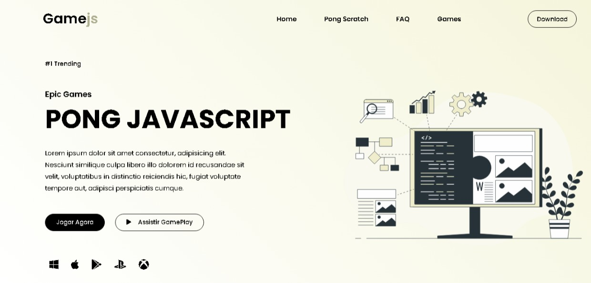

<h1 align="center"> Pong Game 🏓</h1>

  

## 📝 Descrição
Recriando o jogo pong em duas linguagens de programação diferentes. Tem Suporte apenas para desktop, você encontra as duas versões do jogo clicando nos links.

- Versão Final: [Game Pong](https://marcelo-abreeu.github.io/Pong-JavaScript/)

## 🚀 Tecnologias

Neste projeto foi usado as seguintes Tecnologias:

- HTML
- CSS
- JavaScript
- Scratch

## 📚 Bibliotecas

- [Google Fonts](https://fonts.google.com/)

- [P5 JS Library](https://p5js.org/)

-----

<h3 align="center"> Developed by <a href="#">Marcelo Abreu ☕</a></h3>
