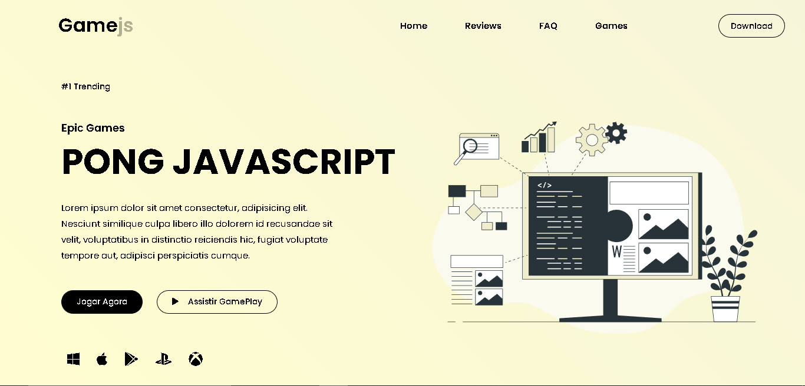
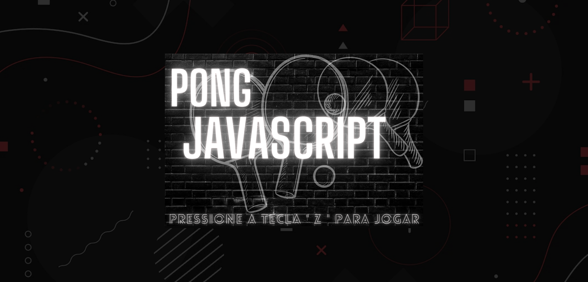

<h1 align="center"> Pong Game 🏓</h1>

  

    

## 📝 Descrição
Recriando o jogo pong em duas linguagens de programação diferentes. Suporte apenas para desktop.

- Versão Final: [Game Pong](https://marcelo-abreeu.github.io/Pong-JavaScript/)

## 🚀 Tecnologias

Neste projeto foi usado as seguintes linguagens de programação:

- HTML

- CSS

- JavaScript

- Scratch

## 📚 Bibliotecas

- [Google Fonts](https://fonts.google.com/)

- [Biblioteca P5 JS](https://p5js.org/)

-----

<h3 align="center"> Developed by <a href="#">Marcelo Abreu ☕</a></h3>
